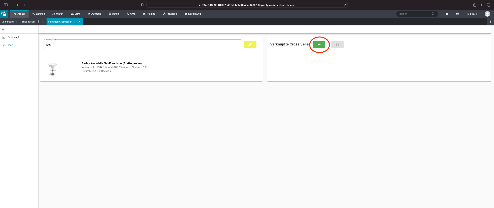

# Variants Cross Seller
This plugin allows you to create cross sellers at article variants to display them on the
corresponding article view.

## Installation & Setup
1. first go to **Plugins » Plugin Set Overview**.
2. select the plugin set in which you want to install our plugin.
3. now go to **Add Plugin**, then select our plugin and press Install.
   
4. **Activate** the installed plugin.
5. next go to **CMS » Shopbuilder** and here to your item view.
6. now add the plugin at the desired position.

   
7. now the widget is already functional, as long as you don't configure any cross sellers, the component remains invisible.
8. configure your cross sellers

### Configuring a Cross Seller
1. go to **Item » Variations Cross Seller** to go to our user interface.
   When you are in the user interface click **Create a new link**.
   
3. search for the variant you want and click on it.
   
4. now click on the "plus" at Linked Cross Seller
   
5. search for the cross sellers you want and select them. Now you just have to click "Add Cross Seller".
   

####-Dashboard with an overview of all configured cross sellers:
- In the "Dashboard" tab of the interface  you will find all already configured Cross Sellers.
####-Update and delete configurations:
- To delete a configuration simply select the variant,
  where the configuration should be removed and click on the "Delete" button
  

- To update a configuration simply add new cross sellers or delete them,
  Your changes will be saved automatically
  

## Example of configured Cross Seller

###Frontend:

###UI:

